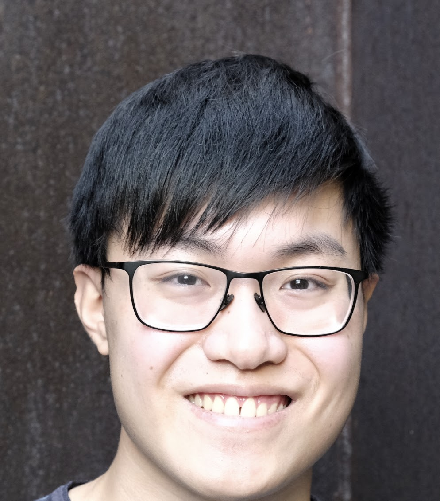

## About Me

I am an incoming PhD student at the Language Technologies Institute within Carnegie Mellon University’s School of Computer Science. Before joining LTI, I graduated with a B.S. in Math and Computer Science from Harvey Mudd College, where I worked with [https://www.caldenwloka.com/](Profs. Calden Wloka) and [https://sites.google.com/g.hmc.edu/hzinnbrooks](Heather Zinn Brooks).

I’m broadly interested in pragmatics, truthfulness, and interpretability in natural language systems. Some specific subquestions I’m currently interested in include:

* What kinds of representations related to other agents can NLP models learn in interactive environments?
* How do language agents communicate in multiagent settings?
* How can NLP models be trained to be more robustly truthful?

Feel free to reach out at **andyliu@andrew.cmu.edu** if you’re interested in my work or in collaborating!